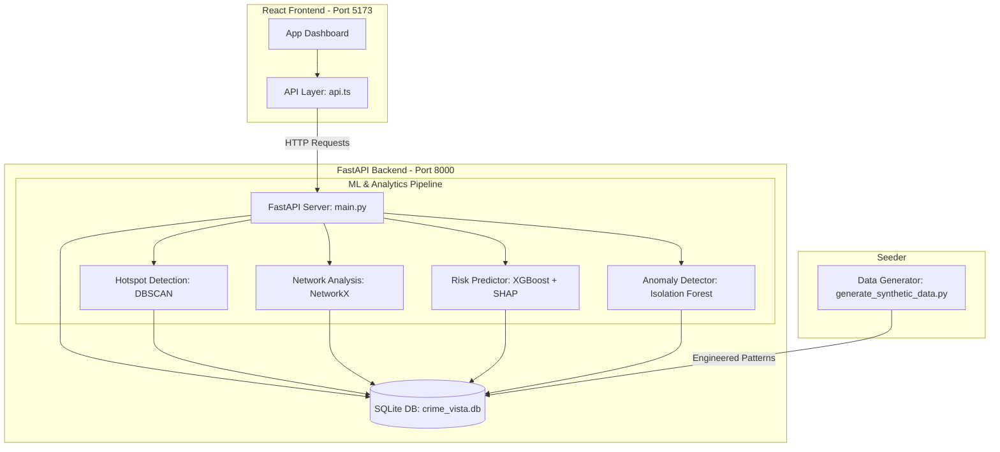

# CrimeVista AI — Crime Intelligence Analytics Platform

A full-stack crime intelligence dashboard prototype developed for the Karnataka State Police (KSP) Datathon 2026. This monorepo features a Python FastAPI machine learning backend driven by a seeded SQLite database and a responsive React client dashboard.

## System Architecture



---

## Technical Features

1. **Hotspot Detection (DBSCAN / ST-DBSCAN):** Groups crime coordinates and occurrence hour parameters to locate high-density zones, computing rolling alerts for district crime rate spikes (+25%).
2. **Network Analysis (NetworkX + Louvain community detection):** Resolves repeat offender co-occurrences, maps communities of crime cells, and computes betweenness centrality for key figures.
3. **Risk Forecasting (XGBoost Regressor + SHAP explainer):** Forecasts next-30-day crime counts per district and crime category. Shows explanation contributions for each prediction via SHAP explainability.
4. **Outlier/Anomaly Detection (Isolation Forest):** Evaluates case properties to identify statistically anomalous incidents for investigator review.

---

## Prototype Benchmarking Slide Data

### XGBoost Risk Forecasting Model Metrics
* **Dataset Size:** 3,000 samples (constructed from 1,924 seeded historical records)
* **Mean Absolute Error (MAE):** `0.3971` cases
* **Coefficient of Determination (R² Score):** `0.2582`

### XGBoost Feature Importance Breakdown:
1. **Seasonal Index (Historical Calendar Month Average):** `57.7%`
2. **Hotspot Density (DBSCAN Active Cluster Counts):** `15.6%`
3. **Trend Ratio (3-month / 12-month average ratio):** `7.9%`
4. **Repeat Offender Count (Active District Recidivism):** `7.0%`
5. **Prior 12-Month Average Count:** `6.6%`
6. **Prior 3-Month Average Count:** `5.1%`

---

## Setup & Running Instructions

Ensure Python 3.13+ and Node.js are installed on your machine.

### 1. Database Seeding & Seeder
Wipe the database and regenerate the ~2,000 cases with the 7 engineered patterns:
```bash
# Navigate to the root directory
cd CrimeVista-AI

# Create virtual environment, install dependencies, and run seeder
cd backend
python -m venv venv
venv\Scripts\activate
pip install -r requirements.txt
cd ..
python data/generate_synthetic_data.py --reset
```

### 2. Run Machine Learning Training
Train the XGBoost regressor, calculate SHAP explanations, and save the serialized model:
```bash
# From root directory, activate virtual environment
backend\venv\Scripts\activate
python backend/ml/train_risk_model.py
```

### 3. Start Backend Server
Start the FastAPI server on port 8000:
```bash
# From root directory
backend\venv\Scripts\activate
uvicorn backend.main:app --reload
```
API endpoints will be live at `http://127.0.0.1:8000`. Swagger documentation is available at `http://127.0.0.1:8000/docs`.

### 4. Start Frontend Server
Start the React application:
```bash
# In a new terminal, navigate to the frontend directory
cd frontend
npm install
npm run dev
```
The React App will be accessible at `http://localhost:5173`.
